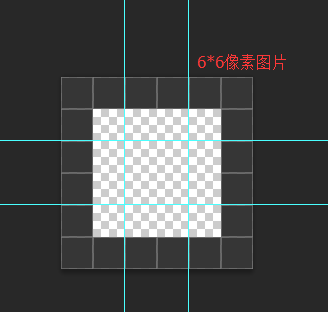
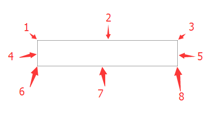
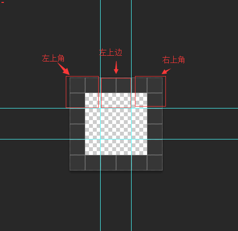
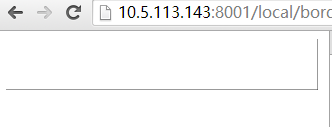

##  1像素边框  ##(1px圆角边框使用方法类似)
<small>created by yaoxiangyang, 2014-12-13 </small>

很多地方代码中的1px边框很粗，为了解决这个问题，带来以下解决方案。

**使用**

后续改方法将写到base.css中，需要使用1px边框的地方，直接加上class：“border-1px”。然后设置需要显示的边框即可，如：**border-top-width: 1px;**。
1像素圆角边框，直接给容器加上class **border-1px-radius** 即可

实现原理代码：

		//1px边框
     .border-1px{
            -webkit-border-image: url("http://static-ci.mysoft.com.cn/images/border-1px.png") 2 2 stretch;
        }
	//1px圆角边框
	.border-1px-radius{border-width:5px;border-radius:5px;-webkit-border-image: url("http://static-ci.mysoft.com.cn/images/border-1px-radius.png") 10 10 stretch;}

先看下css3的中的border-image属性，下图中的青色线条将整张图片切成8张图片，然后将这8张图片分别填充到元素的边框的各个将整张图片切分到隔个边框中。

8张图片对应的填充边框的位置，分别作为各个位置的背景图片，如下图

如上图，如上图，**上边为1px像素的图片+1px像素的透明，2px的图片会被压缩到1px的边框容器内，相当于使用了background-size：50% 50%的效果**。这样做的好处在于可以利用正常设置边框来完成实际显示1px的边框，具体如下图：

其中，图片填充边框有几种状态 图像边框是否应平铺(repeated)、铺满(rounded)或拉伸(stretched)。默认为stretched填充，我们正是因为用了这种方式，才会让2px的图片(1px线+1px透明)压缩显示到1px的边框中。所以相当于使用background-size：50% 50%的效果。由于图标边框的四个角(就是上图中的左上角，右上角)所以这种实现方式**不能够实现圆角**。

上图中的样式。图片已经转换为data-url。利用 border-width:0 1px 1px 0px; 来对应显示那条边，对于上面的代码，最终显示出来的效果为：右边框和下边框显示

	
    

        

    

## 使用 ##

**1px边框：**后续改方法将写到base.css中，需要使用1px边框的地方，直接加上class：“border-1px”。然后设置需要显示的边框即可，如：**border-top-width: 1px;**。但该方法不能处理圆角，下方案为处理圆角方案。

**1px圆角边框：**直接给元素添加class border-1px-radius即可。

