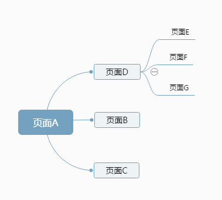

##  前端代码规范-返回问题  ##
<small>created by yaoxiangyang, 2014-11-25 </small>

**一句话：** 往下级用location.href，同级用location.replace，往父级用history.back();

应用中的返回问题，已经不是仅仅对应的普通页面的返回问题，页面中的返回问题，从a到b，从b到c，然后返回的话以此会从c到b到a，但是应用中，返回的时候更想返回到上一级。而不是返回到刚才浏览的页面。

如上图：用页面a到dbc，用location.href，或者用a标签的调整，从d到b页面，则用location.replace的方式，如果从b回到a，请用history.back的方式。

