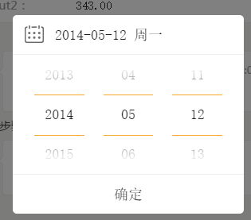
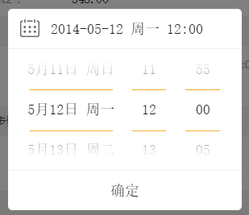

## 时间选择控件 ##

时间格式有两种展现形式，如下图，日期选择与日期十分选择

使用方法：

在页面中引入组件

    <?= _include_once("@vendor/components/datepicker/index.php") ?>

将input上带上 `data-datepicker="2010-10-10 10:20"`属性即可，后面的时间为格式类型

    <input type="text" readonly data-datepicker="2010-10-10 10:20"/>
    <input type="text" readonly data-datepicker="2010-10-10"/>
