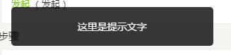
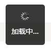
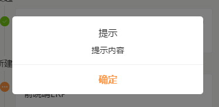
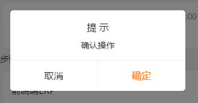
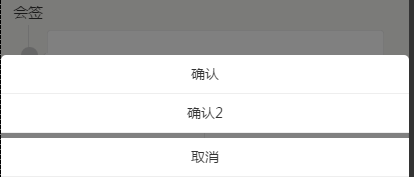

## 浮层提示控件 ##

<small>create by yaoxiangyang at 2015-09-06</small>

引入

    <?= _include_once('@vendor/components/dialog/index.php'); ?>

该组件共有toast ，loading，alert，dialog，modaldialog 5种状体状态

1.toast --提示框，用于显示加载失败，提醒等

	tplData.component.toast = $.toast

    $.toast({
		text:"xxxxxxx",//提示文字名称
		width:100,//容器宽度，可以为 100，"auto",默认290
		closetime:2000, //自动关闭时间，出现提示后自动多久自动关闭
		addClass:"custom",//添加自定义的class到外层容器方便控制样式v
		closeCallback:function(){} //自动关闭时回调函数
	})

	$.toast.close();//关闭

2.loading --loading带文字提示框，提示正在加载等

	tplData.component.loading = $.loading

    $.loading({
		text:"这是一个loading",//提示文字名称
		width:100,//容器宽度，可以为 100，"auto",默认290
		closetime:2000, //自动关闭时间，出现提示后自动多久自动关闭
		addClass:"custom",//添加自定义的class到外层容器方便控制样式
		closeCallback:function(){} //自动关闭时回调函数
	})

	$.loading.close();//关闭

3.alert --alert确认框

	tplData.component.alert = $.alert

	$.alert({
	  	width:"80%", //宽度
        title:"提示", //提示标题
        content:"提示内容", //提示内容
        btntext:"确定", //按钮文字
		callback:function(){}//回调函数，点击确定的时候
	})

	$.alert.close() //关闭

4.dialog --确认取消按钮，在页面中部，有各自回调函数

	tplData.component.dialog = $.dialog

    $.dialog({
		title:"提示",//提示文字名称
		content:"这里是内容", //按钮对话框文字，可以为html
		width:100,//容器宽度，可以为 100，"auto",默认290
		btns:{
			suretext:"确认",//确认按钮文字
			canceltext:"取消", //取消按钮文字
			sure:function(){
				return false; //回调函数，return false的时候，浮层不会关闭
			},
			cancel:function(){
				return false; //同上
			}
			
		},
		addClass:"custom",//添加自定义的class到外层容器方便控制样式
		closetime:2000, //自动关闭时间，出现提示后自动多久自动关闭
		closeCallback:function(){} //自动关闭时回调函数
	})

5.modaldialog  --底部按钮组,从底部弹出按钮，有回调函数

	tplData.component.modaldialog = $.modaldialog

    $.modaldialog({
		btns:[
			{type:"1",text:"按钮名称1"},{type:"2",text:"按钮名称2"}
		],
		callback:function(type){
			console.log(type);
			//callback回调函数，会将点击按钮的type回传
		},
		addClass:"custom"//添加自定义的class到外层容器方便控制样式
	})

	$.modaldialog.close();

 
