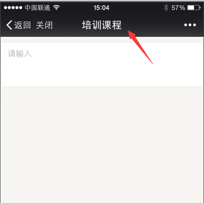

## 页面title设置组件 ##

由于在ios微信中，设置document.title不生效，通过该组件来解决此问题，如下图
 

**使用方法：**
    
    <?= _include_once("@vendor/components/setPageTitle/index.php") ?>

在页面中引入如上代码，然后通过调用

    tplData.component.setPageTitle("这里是设置title"); //或者
	$.setPageTitle("这里是设置title");//来设置title