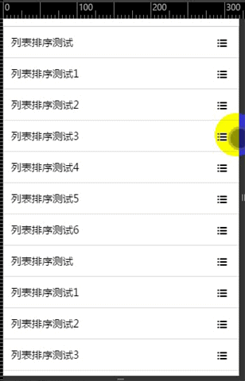

## 排序组件 ##

引入组件：

    <?= _include_once("@vendor/components/sortable/index.php") ?>

 *
 * 手机端列表拖动排序功能
 *

**使用**

    $("#ul").sortable({
       handle:"li", //触发排序的元素，不传默认为li，可传入选择器，如 .font-icon
       draggable:"li",  //排序行，能够拖动的容器，默认ul下的li进行排序
       sortted:function(){} //每次排序，会将dom重排，每次排序后的回调函数
    });

 其中，

    1.对当前排序选中的元素，如li，会添加dragging的class,如果需要修改正在排序的元素样式，可以用class。
    2.对于当前排序的元素，会有一个copy实例 有一个特有的class dragcopy，如果需要定义拖动的排序元素样式，可以用该class

有功能扩展与需求联系@姚向阳
    